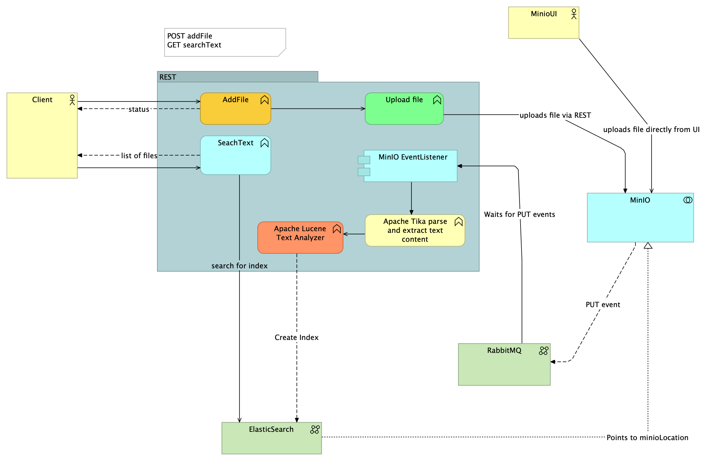

# MinIOSearch
- This Repo contains services which allows user to upload files like text/log(PLAIN) along with NON_PLAIN file types (eg. PDF, Docx, CSV, EXCEL)
- the services automatically generates an event when a files is added this goes to RABBITMQ and then the file is processed and indexed to Elastic search.
- we can search for a word(contains search), the API will return list of files in which this word exists in MinIO.
```bash
curl --location 'http://localhost:8080/api/v1/search?w=aarch64' \
--header 'Authorization: Basic dXNlcjpzZWNyZXQ='
```
- we can also search using file path(contains search)
```bash
curl --location 'http://localhost:8080/api/v1/search?f=assignment.pdf' \
--header 'Authorization: Basic dXNlcjpzZWNyZXQ='
```
- User can even combine these 2 filters
```bash
curl --location 'http://localhost:8080/api/v1/search?f=pdf&w=python' \
--header 'Authorization: Basic dXNlcjpzZWNyZXQ='
```

  
### Product Requirements Documents (PRD)

Please find prd [here](./docs/PRD.md)

### High level Design (HLD)


### Local Setup

1. Run the Docker Compose file with the following command:

   ```bash
   docker-compose up -d
   ```
   This command starts the containers in the background.

2. Accessing RabbigMQ
   - RabbitMQ UI can be accessed at [rabbigMQUI](http://localhost:15672)
   - docs [here](https://docs.spring.io/spring-boot/docs/current/reference/html/messaging.html#messaging.amqp.rabbitmq)
   - creating exchange, vhost and queue in RabbitMQ for MinIO
```text
Run content of  [file](./setup_rabbit.sh) inside rabbitMQ pod
```

3. Access MinIO:
    - MinIO Console (Web UI) is available at [minio](http://localhost:9001).
    - Use the credentials `minioadmin` for both the username and password (change these in production).
    - documents uploaded throw `API` are available in bucket `docs-bucket`
    - setting `put` the event from MinIO to RabbitMQ using ( run inside MinIO pod )
```text
Run content of  [file](./setup_minio.sh) inside minIO pod
```
4. Access Elasticsearch:
    - Elasticsearch can be accessed at [elasticsearch](http://localhost:9200)
    - Index used here is `file-words`

5. Accessing Confluent Kafka
   - Kafka control center is available [here](http://localhost:9021)
   - quick-start [docs](https://docs.confluent.io/platform/current/platform-quickstart.html) 

### API Docs
1. Run the application running at `localhost:8080`
1. Swagger UI docs are available at [Swagger docs](http://localhost:8080/swagger-ui/index.html#/)
   * Note - Authentication is enabled for all api end points, use `user` and `secret` 

